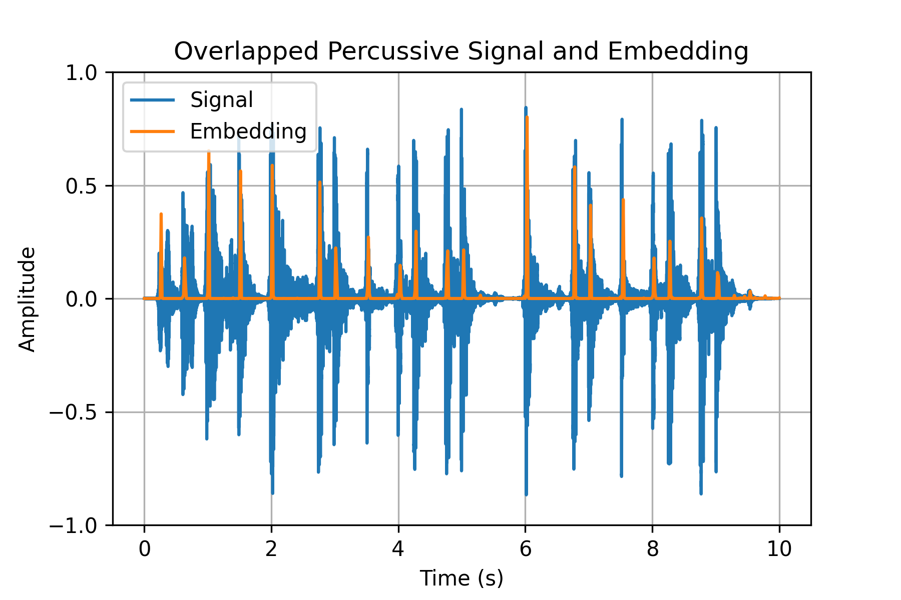

# Zero-Note Samba: Self-Supervised Beat Tracking

<p align="center">
        
</p>

by [Dorian Desblancs](https://www.linkedin.com/in/dorian-desblancs), [Vincent Lostanlen](https://www.lostanlen.com/), and [Romain Hennequin](http://romain-hennequin.fr/En/index.html).

## About

This repository contains the code used to generate the ZeroNS results. All experiment settings can be found in the `configuration/config.yaml` file. These include learning rates and evaluation modes for each downstream dataset, for example. For the pretext task, one can change the batch size and temperature parameters, among other elements.

## Getting Started

In order to explore the embeddings output by our ZeroNS model, one can install all the dependencies using 
```bash
pip install -r requirements.txt
```

after cloning into the repository. One can then get started with the following Python code snippet in order to explore the trained model's outputs:

```python
# Import functions and packages
import torch
import librosa
import IPython.display as ipd
from spleeter.separator import Separator

# Run Spleeter and create percussive and non-percussive tracks
separator = Separator('spleeter:4stems')

y, _ = librosa.load('/path/to/music/file', sr=44100)
stems = separator.separate(waveform=y)

drums = (stems['drums'][:, 0] + stems['drums'][:, 1]) / 2
other = (stems['other'][:, 0] + stems['other'][:, 1] \
        + stems['vocals'][:, 0] + stems['vocals'][:, 1] \
        + stems['bass'][:, 0] + stems['bass'][:, 1] ) / 2

drums = librosa.resample(drums, 44100, 16000)
other = librosa.resample(other, 44100, 16000)

drums_tensor = drums.reshape((1, 1, drums.shape[0], musdb.shape[1]))
other_tensor = other.reshape((1, 1, other.shape[0], musdb.shape[1]))

# Generate VQTs
vqt_postve = torch.from_numpy(IR.generate_XQT(drums_tensor, 16000, 'vqt'))
vqt_anchor = torch.from_numpy(IR.generate_XQT(other_tensor, 16000, 'vqt'))

# Load pretext task model weights
device = torch.device('cpu')
model = Down_CNN()
state_dict = torch.load("models/saved/shift_pret_cnn_16.pth", map_location=device)
model.pretext.load_state_dict(state_dict)
model.eval()

# Ouput percussive, non-percussive, and combined networks
percussive = model.pretext.postve(vqt_postve.float())
non_percussive = model.pretext.anchor(vqt_anchor.float())
combined = model(vqt_anchor.float(), vqt_postve.float())

# Play each track
ipd.display(ipd.Audio(drums, rate=16000))
ipd.display(ipd.Audio(other, rate=16000))
ipd.display(ipd.Audio(librosa.resample(y, 44100, 16000), rate=16000))

# Plot overlapped signals
vqt_len = vqt_postve.shape[1]

plt.plot(non_percussive.detach().numpy().reshape(vqt_len))
plt.plot(percussive.detach().numpy().reshape(vqt_len))
plt.title("Overlapped Embeddings")
plt.legend(["Non-percussive", "Percussive"])
plt.xlabel("Time (samples)")
plt.ylabel("Amplitude")
plt.grid(True)
plt.ylim((-0.1, 1))
plt.yticks([0., 0.25, 0.5, 0.75, 1.0])
plt.show()

x1 = np.linspace(0, 10, 10 * 16000)
x2 = np.linspace(0, 10, vqt_len)

plt.plot(x1, drums)
plt.plot(x2, percussive.detach().numpy().reshape(vqt_len))
plt.title("Overlapped Percussive Signal and Embedding")
plt.legend(["Signal", "Embedding"])
plt.xlabel("Time (s)")
plt.ylabel("Amplitude")
plt.grid(True)
plt.ylim((-1, 1))
plt.yticks([-1.0, -0.5, 0., 0.5, 1.0])
plt.show()

plt.plot(x1, others)
plt.plot(x2, non_percussive.detach().numpy().reshape(vqt_len))
plt.title("Overlapped Non-percussive Signal and Embedding")
plt.legend(["Signal", "Embedding"])
plt.xlabel("Time (s)")
plt.ylabel("Amplitude")
plt.grid(True)
plt.ylim((-1, 1))
plt.yticks([-1.0, -0.5, 0., 0.5, 1.0])
plt.show()
```

The result should resemble the following output:

- Overlapped Embeddings


- Overlapped Percussive Signal and Embedding


- Overlapped Non-percussive Signal and Embedding


## Advanced Usage

The pretext task code can be found in `pretext.py` and `fma_loader.py`. All processing for downstream tasks can be found in `ballroom.py`, `gtzan.py`, `hainsworth.py`, and `smc_mirex.py`. All downstream tasks can be found in the following:
- beat tracking: `beat_down.py`.
- cross-dataset generalization: `cross_data.py`.
- few-shot beat tracking: `data_exp.py`.
The code for information-theoretic measures on ZeroNS network can be found in `measures.py` and librosa's beat tracking method is in `old_school.py`. Finally, one can find the model and processing code in `models/` and `processing`.

## Citation

If you use this repository, please consider citing:

```
To be completed upon publication of the paper.
```
